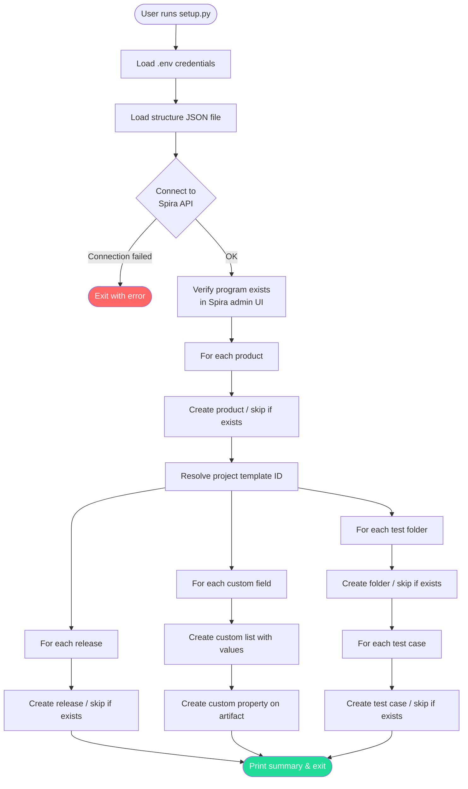

# Spira Project Setup Tool

A config-driven Python script that provisions a complete Spira project structure via the Spira REST API v7. Define your programs, products, releases, custom fields, test folders, and test cases in a JSON file — then run one command.

**[▶ View presentation](https://dermotcanniffe.github.io/OetkerDemo/)**

## How It Works



## Features

- Creates Spira **products** and associates them with a program
- Creates **releases** (test periods) within products
- Creates **custom list fields** on test cases and test sets
- Creates **test case folders** and populates them with **test cases**
- Fully **idempotent** — safe to re-run; existing resources are skipped
- Config-driven — no code changes needed for new clients or projects

## Prerequisites

- Python 3.11+
- A Spira instance (SpiraTest, SpiraTeam, or SpiraPlan) with API access
- A Spira user with sufficient permissions (Product Owner or System Admin recommended)

> **Note:** Programs (portfolios) cannot be created via the Spira REST API. Create the program manually in the Spira admin UI before running this script.

## Setup

**1. Clone the repo**

```bash
git clone https://github.com/dermotcanniffe/OetkerDemo.git
cd OetkerDemo
```

**2. Install dependencies**

```bash
pip install -r requirements.txt
```

**3. Configure credentials**

Copy the example env file and fill in your Spira details:

```bash
cp .env.example .env
```

Edit `.env`:

```
SPIRA_BASE_URL=https://your-instance.spiraservice.net/
SPIRA_USERNAME=your-username
SPIRA_API_KEY={your-api-key}
```

Your API key is your Spira RSS token. Find it under your user profile in Spira — include the curly braces.

**4. Define your project structure**

Copy the example structure file and edit it for your client:

```bash
cp spira-structure.example.json spira-structure.json
```

Edit `spira-structure.json` with your program name, products, releases, custom fields, and test cases. See [Structure File Reference](#structure-file-reference) below.

**5. Run the script**

```bash
# Use the default spira-structure.json
python setup.py

# Or specify a named structure file
python setup.py my-client-structure.json
```

The script will print a summary of everything created when it completes.

## Structure File Reference

```json
{
  "program": {
    "name": "Your Portfolio Name",
    "products": [
      {
        "name": "Your Product Name",
        "releases": [
          { "name": "Release 1" }
        ],
        "customFields": {
          "testCases": [
            {
              "name": "Field Name",
              "type": "list",
              "values": ["Value 1", "Value 2"]
            }
          ],
          "testSets": [
            {
              "name": "Country",
              "type": "list",
              "values": ["DE", "IT", "FR"]
            }
          ]
        },
        "testFolders": [
          {
            "name": "Folder Name",
            "testCases": [
              {
                "name": "Test Case Name",
                "description": "What this test case verifies."
              }
            ]
          }
        ]
      }
    ]
  }
}
```

| Field | Required | Description |
|---|---|---|
| `program.name` | Yes | Must match an existing program in Spira (created via admin UI) |
| `products[].name` | Yes | Display name for the product/project |
| `releases[].name` | No | Display name for the release (created as Sprint type) |
| `customFields.testCases` | No | List-type custom fields added to test cases |
| `customFields.testSets` | No | List-type custom fields added to test sets |
| `testFolders[].name` | No | Test case folder name |
| `testFolders[].testCases` | No | Test cases to create inside the folder |

## Project Structure

```
├── setup.py                        # Entry point
├── spira-structure.json            # Your client config (gitignored)
├── spira-structure.example.json    # Template to copy for new clients
├── .env                            # Your credentials (gitignored)
├── .env.example                    # Credential template
├── requirements.txt
└── spira_setup/
    ├── client.py                   # HTTP client — auth, retries, error handling
    ├── runner.py                   # Orchestrates setup from the structure file
    └── services/
        ├── projects.py             # Create/find products and programs
        ├── releases.py             # Create releases
        ├── templates.py            # Custom lists and custom properties
        └── test_cases.py           # Test folders and test cases
```

## Adding a New Client

1. Copy `spira-structure.example.json` to a new file, e.g. `acme-structure.json`
2. Fill in the client's program, products, and test structure
3. Update `.env` with the client's Spira URL and your credentials
4. Run `python setup.py acme-structure.json`

You can maintain multiple structure files in the same repo — one per client, project phase, or environment — and pass the relevant file at runtime:

```bash
python setup.py acme-structure.json
python setup.py oetker-structure.json
python setup.py oetker-phase-b-structure.json
```

If no file is specified, `spira-structure.json` is used by default.

> **Working in a client-specific repo?** Remove the `spira-structure.json` line from `.gitignore` so your structure files are tracked. The comment in `.gitignore` explains when to do this.

## Generating Structure Files with an LLM

The `spira-structure.schema.json` file in this repo is a [JSON Schema](https://json-schema.org/) that formally describes every field the setup script accepts. You can use it to generate valid structure files from a plain-English brief using any LLM (ChatGPT, Claude, Kiro, Copilot, etc.).

**How to use it:**

Include the schema in your prompt, then describe what you need:

> *"Using the attached JSON Schema, generate a Spira structure file for a logistics client. They need two products — one for their WMS system and one for their TMS system. Each product needs releases for Q3 and Q4 2025. Test cases should cover order creation, shipment tracking, and returns processing. Add a Country custom field (DE, IT, FR) to test sets."*

The LLM will produce a ready-to-run structure file that conforms to the schema.

**Editor support:**

Any structure file that includes the `$schema` reference (as in `spira-structure.example.json`) will get live autocomplete and validation in VS Code and other JSON-aware editors — no plugin required.

```json
{
  "$schema": "./spira-structure.schema.json",
  "program": { ... }
}
```

**What the schema enforces:**

- Required fields (`name` is required everywhere)
- Field types and length limits
- Valid values for `type` (currently only `"list"`)
- No unexpected extra fields (`additionalProperties: false`)
- Descriptive `description` fields on every property explaining intent to both humans and LLMs

## Extending the Tool

The codebase is designed to make adding new Spira artifact types straightforward. Here's how to approach the most common extension scenarios.

**Adding a new artifact type (e.g. test sets, requirements)**

1. Create a new file in `spira_setup/services/`, e.g. `test_sets.py`
2. Follow the same pattern as the existing service files:
   - A `get_all_*` function that calls `client.get(...)`
   - A `get_*_by_name` function for idempotency checks
   - A `create_*` function that checks for existence first, then POSTs
3. Add the new artifact to the structure JSON schema (and update `spira-structure.example.json`)
4. Call your new service functions from `runner.py` in the appropriate place in the per-product loop

**Adding a new custom field type (e.g. text, integer, date)**

Currently only `list` type custom fields are supported. To add another type:

1. Open `spira_setup/services/templates.py`
2. Add a new `create_*_property` function alongside `create_custom_list_property`
3. In `runner.py`, update `_setup_custom_fields` to dispatch on `field_def["type"]` to the new function

**Changing what the script reads from the JSON**

All structure parsing happens in `runner.py`. The JSON shape is intentionally simple — if you need to add new fields to a product or test case definition, add them to the JSON and read them in `runner.py`. No other files need to change.

**Calling the Spira API directly**

All HTTP calls go through `spira_setup/client.py`. The `SpiraClient` class exposes `get`, `post`, `put`, and `delete` methods. Use these rather than calling `requests` directly — you get auth, retries, and error handling for free.

```python
from spira_setup.client import SpiraClient

client = SpiraClient(base_url, username, api_key)

# GET
projects = client.get("projects")

# POST
new_item = client.post("projects/{id}/test-cases", {"Name": "My Test", ...})

# PUT
client.put("projects/{id}/releases", updated_body)
```

The full list of available endpoints is documented at `{your-spira-url}/Services/v7_0/RestService.aspx`.

## Authentication

Credentials are passed via HTTP headers on every request (`username` and `api-key`). They are never logged or printed. Keep your `.env` file out of source control — it is gitignored by default.
